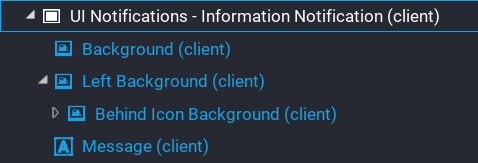

# Custom Template

There is only really one rule to creating a custom notification template, and that is the `UIText` object that will display the message of the notification must be named `Message`.  This is because the system looks for it dynamically at runtime just to make it a little easier so you don't need to setup a custom property.

Here is an example of one of the default templates structure.

