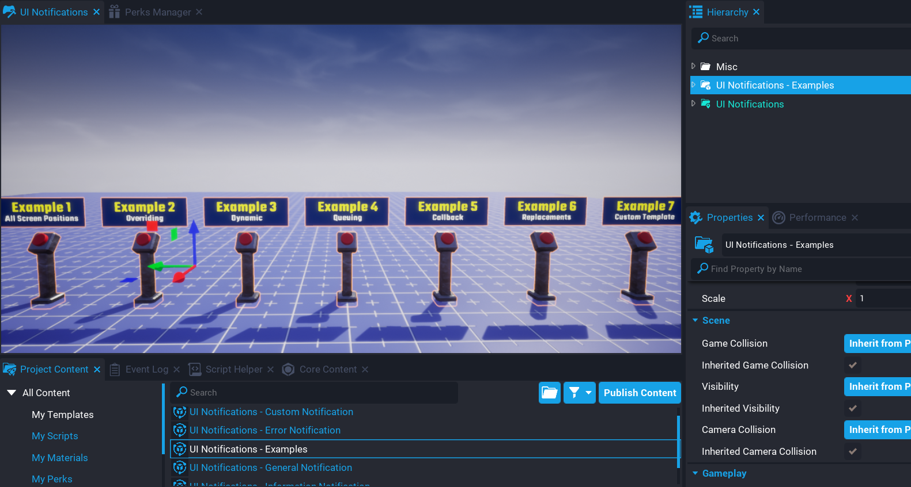

# Examples

There are 7 examples to try out that come with the system.  

Drag and drop the `UI Notifications - Examples` template into your hierarchy and enter play mode to test out show examples of how you could use this notification system.

