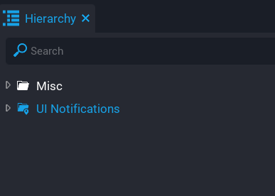

# Quick Start

If you want to just get straight into using the system then follow these steps.

1.  Drag and drop the template `UI Notifications` into your hierarchy.
2.  Send a broadcast to `show_notification` containing your message.

```lua
Events.Broadcast("show_notification", "This is my notification.")
```

