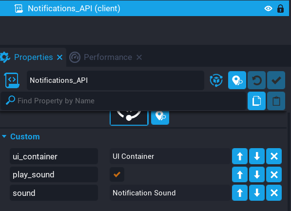

# Settings

The `UI Notifications` system has a couple of settings that may be useful to know.

In the `UI Notifications` group in the hierarchy, epand it and highlight the `Notifications_API` script.  You should see a couple of properties.

| Property | Description |
| -------- | ----------- |
| `ui_container` | This is the parent UI Container where the notifications will become a child of. |
| `play_sound` | This property allows you to turn of the notification sound for the system. |
| `default_sound` | This is the default sound the system uses for the notifications. |

